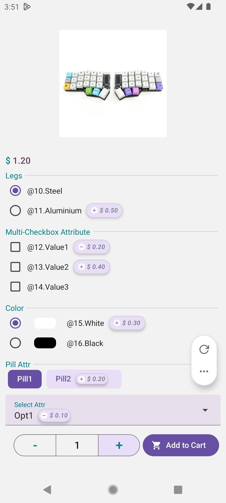
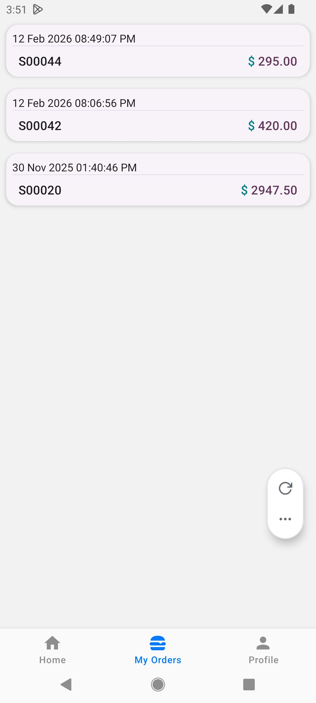
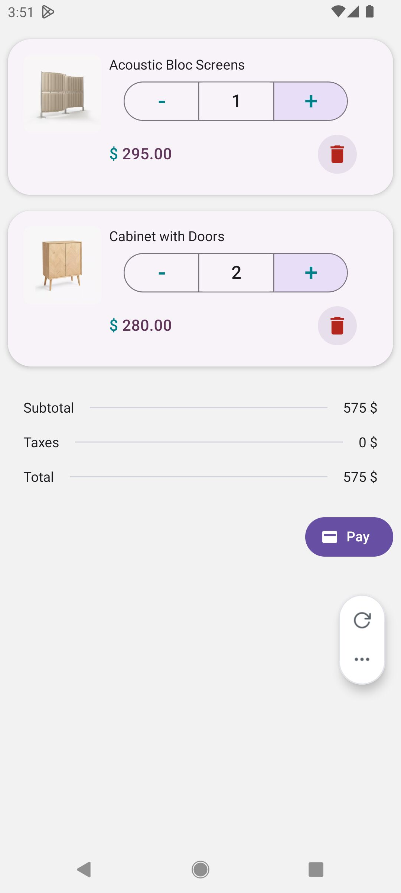
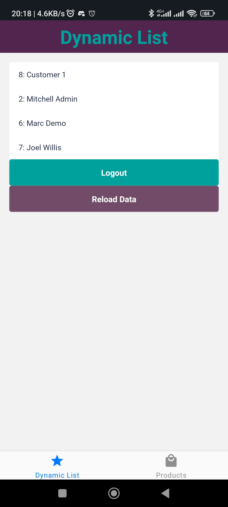

# Odoo React Native Client
This project is still in the early development stage, and major changes will be applied.

## ⚠️ This app depends on a Odoo module found here: https://github.com/obayit/obi-app-api

## How to run

### Step 1:
Configure your database and URL by creating a `.env` file, you can copy `.env.example` with the command `cp .env.example .env` then change the values to match your DB and URL.
Later, to change values of DB and URL, also clear expo cache by adding the `-c` to the expo start command below.

### Step 2:
This is a managed expo project, run the following commands to start the development: `npm install`, then`npx expo start`


## Screenshots







### Used libraries
* State Management: redux (RTK Query)
* Navigation: React Navigation
* Form data: React Hook Form
* Form validation: Yup

## Features
* Centralized Error Handling: errors can be triggered using a callback method provided by APIErrorContext context.
* Can add odoo models data dynamically (e.g: add a `search_read` endpoint for `res.currency`). This is achived with RTK Query's `injectEndpoints`.

### Milestones:
* Field builder: build the _react-hook-form_ form using an object describing the field properties.
* API: search_read (with paging), read
* API: create, write, unlink
* API: attachments
* UI: UI Kitten custom mapping to match Odoo theme


### Why react-native-svg is not in sync with expo version?
because the expo version causes an error for ui kitten eva icons, see: https://github.com/akveo/react-native-ui-kitten/issues/1675

If you see the error:
```
Attempt to invoke virtual method 'int java.lang.Integer.intValue()' on a null object reference
setTintColor
SvgView.java:1
```
That is because an incompatible version of react-native-svg is installed, see the above issue.

### TODOs
* add patch to make Card.Cover use expo-image instead of react-native's one (because react-native image doesn't send headers)

### Known Issues ⚠️
* SelectionInput (aka Dropdown)
  - first tab doesn't open the options menu!
* if session expired, the app doesn't logout automatically (of course only public info is accessible)
